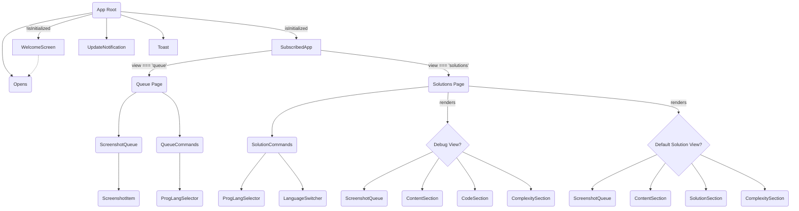

# 渲染器页面与核心组件文档

本文档详细介绍了应用渲染器 (`renderer`) 目录下的主要页面和核心组件的功能与结构，并结合实际运行日志分析了组件间的依赖关系和执行顺序。

---

## 典型用户使用路径

以下描述了用户与此应用程序交互的典型流程：

1.  **首次启动与初始化:**
    *   用户启动应用程序。
    *   应用首先显示 **欢迎屏幕 (`WelcomeScreen`)**，提供基本介绍和快捷键列表。
    *   同时，应用在后台进行初始化，检查必要的配置，特别是 API 密钥。

2.  **设置 API 密钥 (如果需要):**
    *   如果应用检测到没有配置 API 密钥，**设置对话框 (`SettingsDialog`)** 会自动弹出（或用户可以通过欢迎屏幕上的按钮手动打开）。
    *   用户在设置对话框中输入并保存他们的 OpenAI API 密钥。
    *   保存成功后，应用通常会重新加载或标记为已初始化。

3.  **进入主应用界面:**
    *   一旦应用初始化完成并且 API 密钥已设置，界面会切换到 **主应用界面 (`SubscribedApp`)**。
    *   默认情况下，主应用界面会显示 **截图队列 (`Queue`)** 视图。

4.  **捕获与管理截图:**
    *   用户使用全局快捷键 (例如 `Cmd+H` / `Ctrl+H`) 捕获屏幕截图。
    *   每次截图后，新的截图会出现在 **截图队列 (`Queue`)** 视图中。
    *   用户可以在队列视图中查看截图预览，并使用快捷键 (`Cmd+L` / `Ctrl+L`) 或界面按钮删除不需要的截图。
    *   用户可以在此视图选择目标编程语言。

5.  **处理截图并生成解决方案:**
    *   当用户准备好后，他们使用快捷键 (`Cmd+Enter` / `Ctrl+Enter`) 或点击队列命令区域的按钮来处理当前队列中的所有截图。
    *   应用将截图发送到后端进行处理。
    *   主应用界面 (`SubscribedApp`) 会自动切换到 **解决方案 (`Solutions`)** 视图，并开始显示处理进度或结果。

6.  **查看解决方案:**
    *   在 **解决方案 (`Solutions`)** 视图中，用户可以看到：
        *   从截图中提取的 **问题陈述**。
        *   AI 生成解决方案时的 **思考过程**。
        *   生成的 **代码解决方案** (带语法高亮和复制按钮)。
        *   代码的 **时间/空间复杂度分析**。
        *   用于生成该方案的 **截图列表**。

7.  **调试解决方案 (可选):**
    *   如果用户对生成的代码不满意或想进行改进，他们可以在 **解决方案 (`Solutions`)** 视图中触发 **调试** 操作（通过命令区域的按钮）。
    *   应用会使用当前的截图和生成的代码再次与 AI 交互。
    *   处理完成后，视图会切换到 **调试视图 (`Debug`)** (该视图由 `Solutions.tsx` 内部渲染)。
    *   在调试视图中，用户可以看到：
        *   **"What I Changed"** (调试过程中的关键修改点或思考)。
        *   可能 **更新后的代码**。
        *   详细的 **分析与改进** 建议。
        *   更新后的 **复杂度分析**。

8.  **重置与重复:**
    *   用户可以使用快捷键 (`Cmd+R` / `Ctrl+R`) 或界面按钮 **重置视图**，这将清空当前的解决方案/调试结果，并返回到 **截图队列 (`Queue`)** 视图，准备开始新的截图和处理流程。

---

## 组件依赖与执行流程概述

根据日志分析，组件的渲染和交互流程大致如下：

1.  **启动:** `App` 组件首先渲染。
2.  **初始化检查:**
    *   若未初始化 (`!isInitialized`)：`App` 渲染 `WelcomeScreen` 和 `SettingsDialog` (初始隐藏)。
    *   若已初始化 (`isInitialized`)：`App` 渲染 `SubscribedApp`。
3.  **主界面 (SubscribedApp):**
    *   默认渲染 `Queue` 视图。
    *   `Queue` 渲染 `ScreenshotQueue` 和 `QueueCommands`。
4.  **截图:** `onScreenshotTaken` 事件触发 `Queue` 及其子组件 (`ScreenshotQueue`, `QueueCommands`) 重新渲染。
5.  **处理 (Solve):**
    *   用户在 `QueueCommands` 触发处理。
    *   `SubscribedApp` 收到 `onSolutionStart`，切换视图状态为 `solutions`，重新渲染并显示 `Solutions` 组件。
    *   `Solutions` 渲染 `SolutionCommands`，并根据数据加载情况渲染 `ScreenshotQueue`、`ContentSection`、`SolutionSection`、`ComplexitySection`。
6.  **调试 (Debug):**
    *   用户在 `SolutionCommands` (位于 `Solutions` 视图) 触发调试。
    *   `Solutions` 收到 `onDebugStart`。
    *   `Solutions` 收到 `onDebugSuccess`，更新缓存。
    *   `Solutions` 重新渲染，检测到调试数据后，渲染 `Debug` 组件。
    *   `Debug` 组件渲染，显示调试结果及其相关子组件 (`ScreenshotQueue`, `SolutionCommands` 等)。
7.  **重置 (Reset):**
    *   用户触发重置。
    *   `SubscribedApp` 收到 `onResetView`，切换视图状态为 `queue`，清除缓存，重新渲染并显示 `Queue` 视图。
    *   `Queue` 及其子组件重新渲染。

**全局组件:** `SettingsDialog`, `UpdateNotification`, `Toast` 由 `App` 组件始终渲染，其可见性由内部状态或事件控制。

---

## 组件关系图 (Mermaid)

---

## 应用根组件 (App)

**文件路径:** `renderer/App.tsx`

### 概述

`App.tsx` 文件是 React 应用的根组件，负责设置全局上下文（如 i18n、React Query、Toast 通知）、处理应用初始化逻辑、检查 API 密钥，并根据初始化状态决定显示欢迎屏幕 (`WelcomeScreen`) 还是主应用界面 (`SubscribedApp`)。

### 核心逻辑

1.  **初始化流程:**
    *   应用启动时，会检查 i18n 是否加载完成，期间显示加载指示器。
    *   加载完成后，尝试从 `electronAPI.getConfig()` 获取配置（包括编程语言等）。
    *   设置无限额度 (`credits = 999`)。
    *   标记应用为已初始化 (`setIsInitialized(true)`)。
    *   初始化完成后，检查 `electronAPI.checkApiKey()` 是否存在 API 密钥。
2.  **页面渲染:**
    *   如果应用**未初始化** (`isInitialized` 为 `false`)，则显示 `<WelcomeScreen />`。
    *   如果应用**已初始化** (`isInitialized` 为 `true`)，则显示 `<SubscribedApp />`。
    *   如果**没有 API 密钥**，会在短暂延迟后自动打开 `<SettingsDialog />`。
3.  **全局组件:**
    *   `<SettingsDialog />`: 用于配置 API 密钥和其他设置，可以通过欢迎屏幕按钮或 IPC 事件触发打开。
    *   `<UpdateNotification />`: 用于显示应用更新通知。
    *   `<Toast />`: 用于显示全局提示信息（成功、错误等）。

### 全局上下文提供者

*   `I18nProvider`: 提供国际化支持。
*   `QueryClientProvider`: 提供 React Query 客户端实例。
*   `ToastContext.Provider`: 提供 `showToast` 方法和 Toast 状态。
*   `ToastProvider`: 管理 Toast 的渲染。

### 主要状态

*   `isInitialized`: 标记应用是否完成基本配置加载。
*   `hasApiKey`: 标记是否已配置 API 密钥。
*   `isSettingsOpen`: 控制设置对话框的显示状态。
*   `toastState`: 管理当前 Toast 通知的内容和状态。
*   `currentProgrammingLanguage`: 用户选择的编程语言。
*   `credits`: 用户额度（当前版本固定为 999）。

### 与 Electron 的交互

*   **调用:**
    *   `checkApiKey()`: 检查 API 密钥是否存在。
    *   `getConfig()`: 获取应用配置。
    *   `updateConfig()`: 更新配置（例如保存 API 密钥）。
*   **监听:**
    *   `onShowSettings`: 响应打开设置对话框的请求。
    *   `onApiKeyInvalid`: 响应 API 密钥无效的事件。
    *   `onSolutionSuccess`: 响应解决方案成功事件（当前版本无操作）。

### 组件依赖与执行顺序

*   **执行顺序:** `App` 是应用的入口点，在所有其他页面/视图组件之前渲染。它会根据 `isInitialized` 状态决定渲染 `WelcomeScreen` 还是 `SubscribedApp`。
*   **依赖:**
    *   渲染 `WelcomeScreen` 或 `SubscribedApp` (条件渲染)。
    *   始终渲染 `SettingsDialog`, `UpdateNotification`, `Toast`。
    *   依赖 `I18nProvider`, `QueryClientProvider`, `ToastContext.Provider`, `ToastProvider` 提供全局上下文。

---

## 欢迎屏幕 (Welcome Screen)

**文件路径:** `renderer/components/WelcomeScreen.tsx`

### 概述

欢迎屏幕是用户在应用首次启动或尚未完成必要设置（如配置 API 密钥）时看到的初始界面。它旨在引导用户完成初始设置，并提供应用的基本信息和快捷键指引。

### 显示时机

此屏幕在以下情况下显示：

*   当 `App.tsx` 组件的 `isInitialized` 状态为 `false` 时。这通常意味着应用仍在加载配置或等待用户提供必要的设置（例如 API 密钥）。

### 主要功能

1.  **应用介绍:**
    *   显示应用标题 (`t('app.title')`) 和版本标识 ("Unlocked Edition")。
    *   提供简短的欢迎语 (`t('welcome.title')`, `t('welcome.subtitle')`)。

2.  **快捷键列表:**
    *   展示一个清晰的快捷键列表 (`t('shortcuts.title')`)，方便用户快速上手常用操作：
        *   切换应用可见性 (`t('shortcuts.toggle_visibility')`: Ctrl+B / Cmd+B)
        *   截取屏幕截图 (`t('shortcuts.capture_screenshot')`: Ctrl+H / Cmd+H)
        *   删除最后一张截图 (`t('shortcuts.delete_last')`: Ctrl+L / Cmd+L)
        *   处理截图队列 (`t('shortcuts.process_screenshots')`: Ctrl+Enter / Cmd+Enter)
        *   重置视图 (`t('shortcuts.reset_view')`: Ctrl+R / Cmd+R)
        *   退出应用 (`t('shortcuts.quit_app')`: Ctrl+Q / Cmd+Q)

3.  **引导设置:**
    *   提示用户需要配置 API 密钥才能开始使用 (`t('welcome.start')`, `t('settings.api_key_required')`)。
    *   提供一个醒目的 **"设置" (`t('header.settings')`)** 按钮。

4.  **打开设置:**
    *   点击 "设置" 按钮会触发从 `App.tsx` 传入的 `onOpenSettings` 回调函数，该函数负责打开 `SettingsDialog` 组件，允许用户输入和保存 API 密钥等设置。

5.  **加载状态:**
    *   在 i18n 翻译资源加载完成前，会显示一个加载指示器，以确保界面文本能正确显示。

### 组件依赖

*   `./ui/button`: 用于渲染 "设置" 按钮。
*   `react-i18next`: 用于国际化，显示不同语言的文本。

### 组件依赖与执行顺序

*   **执行顺序:** 当 `App` 组件的 `isInitialized` 状态为 `false` 时，由 `App` 组件渲染。
*   **依赖:**
    *   由 `App` 组件渲染和控制。
    *   接收 `onOpenSettings` prop 从 `App` 组件，用于触发 `SettingsDialog` 的显示。
    *   使用 `ui/button` 组件。
    *   依赖 `react-i18next` 进行翻译。

### Props

*   `onOpenSettings: () => void`: (必需) 当用户点击 "设置" 按钮时调用的回调函数。

### 注意事项

*   此屏幕移除了之前可能存在的语言切换器，语言设置现在统一在 `SettingsDialog` 中管理。
*   "Unlocked Edition" 标识表明这是一个无功能限制的版本。

---

## 主应用界面 (SubscribedApp)

**文件路径:** `renderer/_pages/SubscribedApp.tsx`

### 概述

`SubscribedApp` 是应用的核心界面，在用户成功初始化并配置好应用后显示。它充当一个容器，根据当前的应用状态和用户交互，动态地展示不同的子页面（如截图队列或解决方案视图）。

### 显示时机

此界面在以下情况下显示：

*   当 `App.tsx` 组件的 `isInitialized` 状态为 `true` 时。

### 核心功能

1.  **视图管理 (View Switching):**
    *   使用 `view` 状态 (`useState`) 来控制当前显示的子页面。
    *   可能的视图包括:
        *   `"queue"` (默认): 显示截图队列页面 (`<Queue />`)。
        *   `"solutions"`: 显示解决方案页面 (`<Solutions />`)。
        *   (代码中提到了 `"debug"`，但当前渲染逻辑未包含 Debug 页面，而是由 Solutions 内部处理)。
    *   视图切换主要由 Electron 主进程事件触发（见下文"与 Electron 的交互"）。

2.  **动态窗口大小调整:**
    *   使用 `ResizeObserver` 和 `MutationObserver` 监听 `SubscribedApp` 容器 (`containerRef`) 的尺寸和内容变化。
    *   当内容尺寸变化时，通过 `window.electronAPI.updateContentDimensions({ width, height })` 通知主进程调整 Electron 窗口的大小，以适应内容的实际 `scrollHeight` 和 `scrollWidth`。
    *   包含初始强制更新和延迟更新逻辑，以确保窗口大小设置的准确性。

3.  **事件处理与状态同步:**
    *   监听来自 Electron 主进程的多个事件，并据此更新应用状态或视图：
        *   `onResetView`: 当用户触发重置操作（如快捷键 Ctrl+R/Cmd+R）时，清除相关的 React Query 缓存（截图、问题陈述、解决方案等），并将视图切换回 `"queue"`。
        *   `onSolutionStart`: 当开始生成解决方案时，自动将视图切换到 `"solutions"`。
        *   `onUnauthorized`: 处理未授权错误（通常是 API 密钥问题），清除缓存并将视图重置为 `"queue"`。
        *   `onProblemExtracted`: 当问题陈述提取完成时，更新 React Query 中的 `problem_statement` 数据（仅当视图为 `"queue"` 时）。
        *   `onSolutionError`: 当解决方案生成过程中发生错误时，使用 `showToast` 显示错误信息。

### 渲染的视图

根据 `view` 状态，`SubscribedApp` 会渲染以下主要页面组件之一：

*   **`<Queue />`**: 当 `view === "queue"` 时渲染。负责显示和管理待处理的截图队列。
*   **`<Solutions />`**: 当 `view === "solutions"` 时渲染。负责展示生成的代码解决方案，并包含进入调试视图的逻辑。

它会将必要的 props（如 `setView`, `credits`, `currentLanguage`, `setProgrammingLanguage`) 传递给当前渲染的子页面。

### 组件依赖

*   `@tanstack/react-query`: 用于管理服务器状态和缓存（截图、解决方案等）。
*   `../_pages/Queue`: 截图队列页面组件。
*   `../_pages/Solutions`: 解决方案页面组件。
*   `../contexts/toast`: 用于显示全局 Toast 通知。

### 组件依赖与执行顺序

*   **执行顺序:** 当 `App` 组件的 `isInitialized` 状态为 `true` 时，由 `App` 组件渲染。它根据内部 `view` 状态 (`queue` 或 `solutions`) 渲染相应的子页面。
*   **依赖:**
    *   由 `App` 组件渲染和控制。
    *   渲染 `Queue` 或 `Solutions` (条件渲染)。
    *   接收 `credits`, `currentProgrammingLanguage`, `setProgrammingLanguage` props 从 `App`。
    *   依赖 `@tanstack/react-query` (通过 `useQueryClient`)。
    *   依赖 `../contexts/toast` (通过 `useToast`)。

### Props

*   `credits: number`: (必需) 当前用户可用的额度（在此版本中固定为 999）。
*   `currentProgrammingLanguage: string`: (必需) 用户当前选择的编程语言。
*   `setProgrammingLanguage: (language: string) => void`: (必需) 用于更新编程语言设置的回调函数。

### 与 Electron 的交互

`SubscribedApp` 通过 `window.electronAPI` 与 Electron 主进程进行深度交互：

*   **调用:**
    *   `updateContentDimensions`: 通知主进程更新窗口大小。
*   **监听:**
    *   `onResetView`: 响应重置视图的请求。
    *   `onSolutionStart`: 响应解决方案开始生成的事件。
    *   `onUnauthorized`: 响应未授权事件。
    *   `onProblemExtracted`: 响应问题提取完成事件。
    *   `onSolutionError`: 响应解决方案错误事件。

### 数据流和状态管理

*   **React Query:** 核心数据（问题陈述、解决方案、调试结果）存储在 React Query 缓存中，键分别为 `["problem_statement"]`, `["solution"]`, `["new_solution"]`。这些数据主要由 Electron 事件 (`onProblemExtracted`, `onSolutionSuccess`, `onDebugSuccess`) 写入。
*   **Local State:** 使用 `useState` 管理从 React Query 缓存同步过来的数据副本（`problemStatementData`, `solutionData`, `thoughtsData`, `timeComplexityData`, `spaceComplexityData`）以及 UI 状态（`debugProcessing`, `isTooltipVisible`, `tooltipHeight`, `isResetting`）。
*   **截图数据 (`extraScreenshots`):** 通过 `window.electronAPI.getScreenshots()` 获取，并在组件挂载、解决方案成功生成、截图被添加或删除时更新。
*   **`useEffect` Hooks:** 用于：
    *   监听 Electron 事件并更新状态/缓存。
    *   订阅 React Query 缓存变化，将缓存数据同步到本地 state。
    *   管理窗口大小调整逻辑。

### 组件依赖与执行顺序

*   **执行顺序:** 当 `SubscribedApp` 组件的 `view` 状态为 `"solutions"` 时，由 `SubscribedApp` 渲染。它会根据是否存在调试结果 (`["new_solution"]` 缓存) 决定渲染默认的解决方案视图还是 `Debug` 组件。
*   **依赖:**
    *   由 `SubscribedApp` 渲染和控制。
    *   渲染 `Debug` (条件渲染) 或默认视图 (包含 `ScreenshotQueue`, `SolutionCommands`, `ContentSection`, `SolutionSection`, `ComplexitySection`)。
    *   渲染 `SolutionCommands`。
    *   接收 `setView`, `credits`, `currentProgrammingLanguage`, `setProgrammingLanguage` props 从 `SubscribedApp`。
    *   依赖 `@tanstack/react-query` (通过 `useQuery`, `useQueryClient`) 获取和管理解决方案/调试数据。
    *   依赖 `../contexts/toast` (通过 `useToast`)。
    *   依赖 `react-syntax-highlighter` 显示代码。

### 与 Electron 的交互

*   **调用:**
    *   `getScreenshots()`: 获取截图列表。
    *   `deleteScreenshot(path)`: 删除指定路径的截图。
    *   `updateContentDimensions()`: 更新窗口大小。
    *   `openSettingsPortal()`: 请求打开设置界面。
    *   (推测) `processScreenshots()` 或类似函数：启动截图处理流程（由 `QueueCommands` 触发）。
*   **监听:**
    *   `onScreenshotTaken`: 收到新截图信号后，调用 `refetch()` 更新列表。
    *   `onResetView`: 收到重置视图信号后，调用 `refetch()` 更新列表。
    *   `onDeleteLastScreenshot`: 收到删除最后一张截图的信号后，调用 `handleDeleteScreenshot` 删除最后一张截图。如果队列为空，则显示提示。
    *   `onSolutionError`: 收到处理错误信号后，显示错误 Toast，并将视图切换回 `"queue"` (通过调用 `setView("queue")`)。
    *   `onProcessingNoScreenshots`: 收到尝试处理空队列的信号后，显示提示 Toast。

### 辅助组件

*   `CodeSection`: 用于显示代码块的组件，与 `Solutions.tsx` 中的 `SolutionSection` 类似但无复制按钮。
*   `ContentSection` (从 `./Solutions` 导入): 用于显示文本内容。
*   `ComplexitySection` (从 `./Solutions` 导入): 用于显示复杂度。

---

## 截图队列 (Queue)

**文件路径:** `renderer/_pages/Queue.tsx`

### 概述

截图队列页面是用户与应用交互的主要入口点之一。它负责展示用户通过快捷键捕获的所有屏幕截图，并提供操作这些截图的命令，例如删除单个截图或将整个队列发送进行处理。

### 显示时机

此页面在以下情况下显示：

*   当 `SubscribedApp` 组件的 `view` 状态为 `"queue"` 时。这是 `SubscribedApp` 的默认视图。

### 主要功能

1.  **显示截图队列:**
    *   使用 `@tanstack/react-query` (`useQuery` 钩子，查询键 `["screenshots"]`) 通过 `window.electronAPI.getScreenshots()` 异步获取当前存储的截图列表。
    *   将获取到的 `screenshots` 数据传递给 `ScreenshotQueue` 组件进行渲染。
    *   在数据加载期间，`ScreenshotQueue` 组件可能会显示加载状态（具体取决于其内部实现）。

2.  **删除截图:**
    *   `ScreenshotQueue` 组件中的每个截图项都应有关联的删除操作。
    *   当用户触发删除时，调用 `handleDeleteScreenshot(index)` 函数。
    *   该函数通过 `window.electronAPI.deleteScreenshot(screenshotPath)` 通知主进程删除对应的截图文件。
    *   删除成功后，调用 `refetch()` 重新获取截图列表以更新界面。
    *   如果删除失败，会显示错误 Toast 通知。

3.  **队列操作命令:**
    *   渲染 `QueueCommands` 组件，该组件提供对整个队列的操作，例如：
        *   **处理截图:** (推测) `QueueCommands` 中应包含触发截图处理流程的按钮，该流程可能通过 `window.electronAPI.processScreenshots()` (或其他类似 IPC 调用) 启动。
        *   **编程语言选择:** 允许用户通过 `setProgrammingLanguage` prop 更改当前用于代码生成的编程语言。
        *   **打开设置:** (推测) 可能包含打开设置 (`handleOpenSettings` -> `window.electronAPI.openSettingsPortal()`) 的入口。

4.  **动态窗口大小调整:**
    *   与 `SubscribedApp` 类似，使用 `ResizeObserver` 监听内容 (`contentRef`) 的大小变化。
    *   特别考虑了 `QueueCommands` 中可能出现的 Tooltip (`isTooltipVisible`, `tooltipHeight`) 对整体高度的影响。
    *   通过 `window.electronAPI.updateContentDimensions` 动态调整 Electron 窗口大小以适应内容。

### 核心组件

*   **`ScreenshotQueue`**: (位于 `../components/Queue/ScreenshotQueue.tsx`)
    *   负责接收 `screenshots` 数组并将其渲染为可视化的截图列表。
    *   处理单个截图的删除操作，并通过 `onDeleteScreenshot` 回调通知父组件 (`Queue`)。
*   **`QueueCommands`**: (位于 `../components/Queue/QueueCommands.tsx`)
    *   提供针对整个队列的操作按钮（如处理、清空等）。
    *   可能包含编程语言选择器。
    *   通过 `onTooltipVisibilityChange` 回调通知父组件 (`Queue`) 其内部 Tooltip 的可见性和高度，以便进行窗口大小调整。

### 组件依赖与执行顺序

*   **执行顺序:** 当 `SubscribedApp` 组件的 `view` 状态为 `"queue"` 时，由 `SubscribedApp` 渲染。
*   **依赖:**
    *   由 `SubscribedApp` 渲染和控制。
    *   渲染 `ScreenshotQueue` 和 `QueueCommands`。
    *   接收 `setView`, `credits`, `currentProgrammingLanguage`, `setProgrammingLanguage` props 从 `SubscribedApp`。
    *   依赖 `@tanstack/react-query` (通过 `useQuery`) 获取截图。
    *   依赖 `../contexts/toast` (通过 `useToast`)。

### 数据管理

*   使用 `@tanstack/react-query` 管理截图列表的状态。
*   `fetchScreenshots` 函数封装了从 Electron 主进程获取截图数据的逻辑。
*   查询配置为 `staleTime: Infinity` 和 `gcTime: Infinity`，意味着数据在手动失效前不会自动重新获取或被垃圾回收。
*   通过 `refetch()` 手动触发数据刷新（例如，在截图被添加或删除后）。

### 与 Electron 的交互

*   **调用:**
    *   `getScreenshots()`: 获取截图列表。
    *   `deleteScreenshot(path)`: 删除指定路径的截图。
    *   `updateContentDimensions()`: 更新窗口大小。
    *   `openSettingsPortal()`: 请求打开设置界面。
    *   (推测) `processScreenshots()` 或类似函数：启动截图处理流程（由 `QueueCommands` 触发）。
*   **监听:**
    *   `onScreenshotTaken`: 收到新截图信号后，调用 `refetch()` 更新列表。
    *   `onResetView`: 收到重置视图信号后，调用 `refetch()` 更新列表。
    *   `onDeleteLastScreenshot`: 收到删除最后一张截图的信号后，调用 `handleDeleteScreenshot` 删除最后一张截图。如果队列为空，则显示提示。
    *   `onSolutionError`: 收到处理错误信号后，显示错误 Toast，并将视图切换回 `"queue"` (通过调用 `setView("queue")`)。
    *   `onProcessingNoScreenshots`: 收到尝试处理空队列的信号后，显示提示 Toast。

### Props

*   `

---

## 解决方案命令 (SolutionCommands)

**文件路径:** `renderer/components/Solutions/SolutionCommands.tsx`

### 概述

解决方案命令组件提供对解决方案或调试视图的操作接口，包括触发调试流程、重新生成解决方案、选择编程语言和访问应用设置的功能。

### 组件依赖与执行顺序

*   **执行顺序:** 由 `Solutions` 或 `Debug` 组件渲染，提供针对当前解决方案或调试视图的操作。
*   **依赖:**
    *   由 `Solutions` 或 `Debug` 组件渲染。
    *   渲染 `ProgrammingLanguageSelector` 和 `LanguageSwitcher` 组件。
    *   包含一个内部的 Tooltip (设置图标触发)。
    *   接收 `onTooltipVisibilityChange`, `isProcessing`, `extraScreenshots`, `credits`, `currentProgrammingLanguage`, `setProgrammingLanguage` props 从父组件。
    *   依赖 `../../contexts/toast` (通过 `useToast`)。
    *   依赖 `react-i18next` 进行翻译。

---

## 设置对话框 (SettingsDialog)

**文件路径:** `renderer/components/Settings/SettingsDialog.tsx`

### 概述

设置对话框是一个模态窗口，允许用户配置应用的关键设置，特别是 OpenAI API 密钥。它在初始启动检测到无 API 密钥时自动打开，或可以通过欢迎屏幕/应用菜单手动触发。

### 组件依赖与执行顺序

*   **执行顺序:** 由 `App` 组件始终渲染，但其可见性由 `App` 组件的 `isSettingsOpen` 状态控制。通常在首次启动无 API Key 或用户手动触发时显示。
*   **依赖:**
    *   由 `App` 组件渲染和控制。
    *   接收 `open`, `onOpenChange`, `onApiKeySave` props 从 `App`。
    *   使用 `../ui/dialog`, `../ui/input`, `../ui/button` 等 UI 组件。
    *   使用 `../shared/LanguageSwitcher` 组件。
    *   依赖 `../../contexts/toast` (通过 `useToast`)。
    *   依赖 `react-i18next` 进行翻译。

---

## 截图队列展示 (ScreenshotQueue)

**文件路径:** `renderer/components/Queue/ScreenshotQueue.tsx`

### 概述

截图队列展示组件负责将截图数组渲染为可视化列表，并提供查看和删除单张截图的功能。它被多个页面组件（如 `Queue`、`Solutions` 和 `Debug`）复用，用于展示不同上下文中的截图。

### 组件依赖与执行顺序

*   **执行顺序:** 由 `Queue` 组件或 `Solutions`/`Debug` 组件渲染，用于展示截图列表。
*   **依赖:**
    *   由父组件 (`Queue`, `Solutions`, 或 `Debug`) 渲染。
    *   渲染 `ScreenshotItem` 组件 (为每个截图渲染一个)。
    *   接收 `isLoading`, `screenshots`, `onDeleteScreenshot` props 从父组件。

---

## 队列命令 (QueueCommands)

**文件路径:** `renderer/components/Queue/QueueCommands.tsx`

### 概述

队列命令组件提供对截图队列的操作接口，包括处理队列、选择编程语言和访问应用设置的功能。它是用户在截图队列视图中触发主要工作流的入口点。

### 组件依赖与执行顺序

*   **执行顺序:** 由 `Queue` 组件渲染，提供针对截图队列的操作。
*   **依赖:**
    *   由 `Queue` 组件渲染。
    *   渲染 `ProgrammingLanguageSelector` 组件。
    *   包含一个内部的 Tooltip (设置图标触发)。
    *   接收 `onTooltipVisibilityChange`, `screenshotCount`, `credits`, `currentProgrammingLanguage`, `setProgrammingLanguage` props 从 `Queue`。
    *   依赖 `../../contexts/toast` (通过 `useToast`)。
    *   依赖 `react-i18next` 进行翻译。